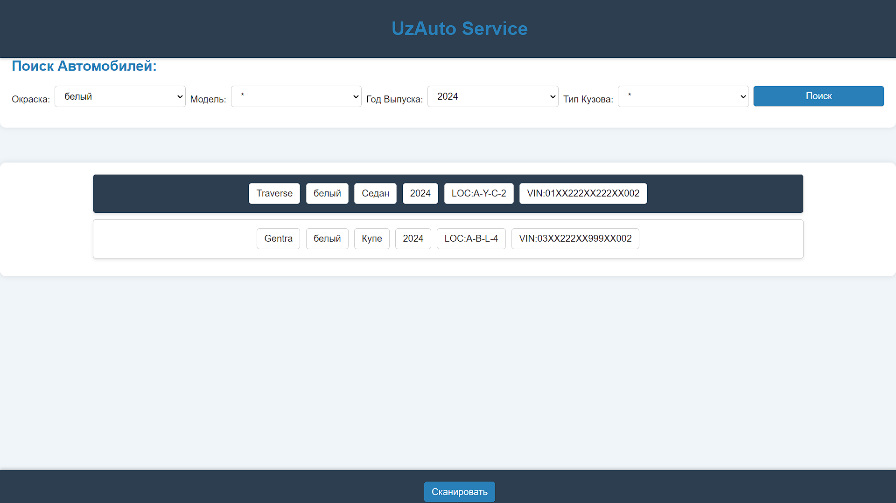
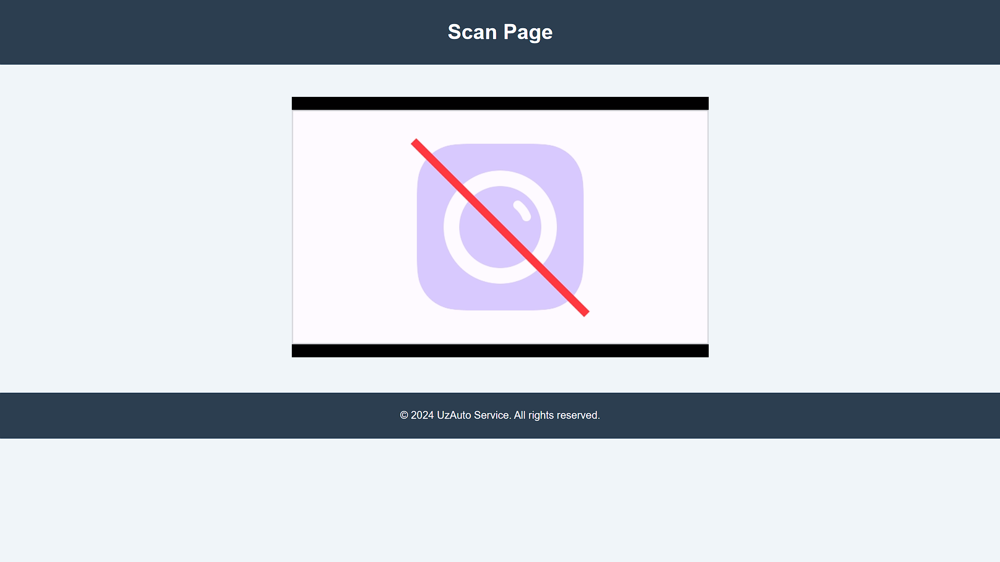

# Vehicle Tracking Web Application

## Features

- **Responsive Design**: Compatible with various device sizes.
- **Search Functionality**: Search vehicles by color, body type, make year, and model.

  

- **Database Integration**: Utilizes MongoDB for storage.
- **Camera Handling**: Prepared for future QR code scanning integration.

  

- **Automatic Parking Management**: Manages incoming and leaving vehicles efficiently.

## Installation

1. Clone the repository: `git clone https://github.com/CodeGeek2006/AutoService-ParkingLot-Control.git`
2. Open the project in any suitable Java IDE.
3. Install MongoDB and set up `application.properties` with your database name.

## Usage

1. Access the web application through the provided URL.
2. Use the search functionality to locate vehicles.
3. Manage incoming and leaving vehicles efficiently.

## Additional Resources

- PowerPoint presentation: [`presentation.pptm`](src/main/resources/other/presentation.pptm)
- Contact: [abdulkhayevbilol@gmail.com](mailto:abdulkhayevbilol@gmail.com)
